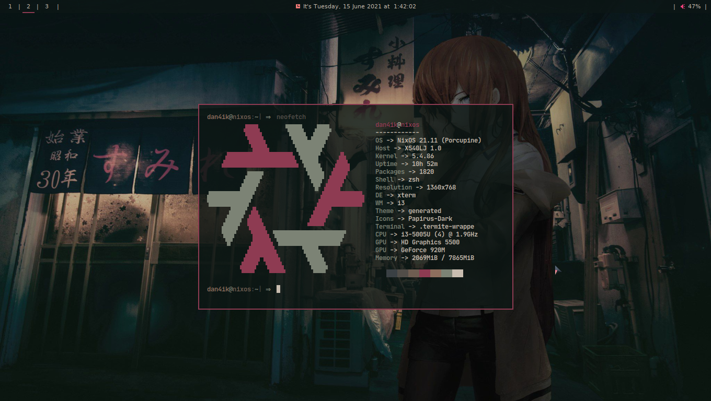

# My dotfiles
 
## Screenshots

## System Configure (current host dan4ik) <space><space>
* OS -> NixOS 21.11 (Porcupine) <space><space><space>
* Shell -> zsh <space><space><space>
* DE -> xterm <space><space><space>
* WM -> i3 <space><space><space>
* Terminal -> .termite-wrappe <space><space><space>
* Terminal font -> JetBrainsMono Nerd Font Mono Bold  <space><space><space>
* Theme -> generated <space><space><space>
* Icons -> Papirus-dark <space><space><space>
 
## List of dependencies <space><space><space> 
* Htop and Bpytop (Task Manager) <space><space><space><space><space>
* Feh (Wallpaper and Image preview) <space><space><space><space><space>
* Compton (Composer) <space><space><space><space><space>
* Termite (Terminal) <space><space><space><space><space>
* Qutebrowser (Browser) <space><space><space><space><space>
* Polybar (Bar whith i3) <space><space><space><space><space>
* Playerctl and pavucontrol (Playback control and Pulseaudio control) <space><space><space><space><space>
* Maim and Xclip (Screenshoter) <space><space><space><space><space>
* Rofi (Application Launcher) <space><space><space><space><space>
* Brightnessctl (Brightness control) <space><space><space><space><space>
* Neovim (Text Editor) <space><space><space><space><space>
