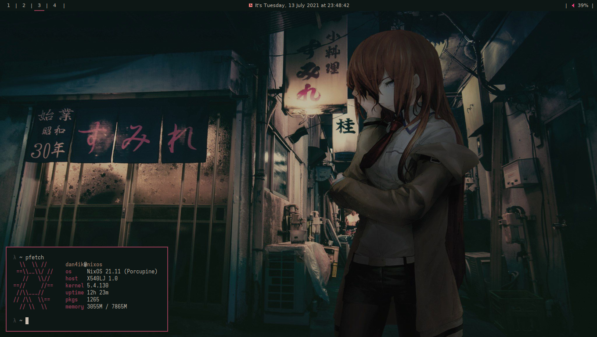

<p align="center">
  <a href="https://nixos.org/nixos"></a>
</p>

<p align="center">
<a href="https://github.com/dan4ik605743/nix-config/actions/workflows/flake-check.yml"></a> <a href="https://github.com/dan4ik605743/nix-config/actions/workflows/format-check.yml"></a> <a href="https://github.com/dan4ik605743/nix-config/actions/workflows/build-check.yml"></a>
</p><p align="center"><a href="https://github.com/hlissner/doom-emacs"></a> <a href="https://github.com/nixos/nixpkgs"></a>
</p>

## Installation
Get the latest NixOS 21.11 image <a href="https://releases.nixos.org/?prefix=nixos/unstable/">here</a>, do your partitions (root must be mounted at =/mnt=), then run the following commands
```
# move the output file of this to hosts/dan4ik(default host)/etc/nixos-unstable_current/nixos/hardware-configuration.nix
nixos-generate-config

nix-shell -p git nixFlakes
git clone https://github.com/dan4ik605743/nix-config ~/
cp -r ~/nix-config/hosts/dan4ik/etc/nixos-unstable_current/nixos/* /mnt/etc/nixos/
sudo nixos-install --flake '/mnt/etc/nixos#nixos'
```

### Caveats
* You probably should replace <a href="https://github.com/dan4ik605743/nix-config/blob/master/hosts/dan4ik/etc/nixos-unstable_current/nixos/system/hardware-configuration.nix">hardware-configuration.nix</a> with your own with nixos-generate-config.
* You should probably change the options a little for yourself.

## Description

NixOS configuration that I use daily, it contains the system-wide and home configuration, symlinked to /etc/nixos.

See also:
* <a href="https://github.com/nix-community/home-manager">home-manager</a>
* <a href="https://nixos.wiki/wiki/Flakes">flakes</a>
* <a href="https://github.com/dan4ik605743/nur">my NUR repo</a>

Resources and configurations I used to base on:
* <a href="https://github.com/fortuneteller2k/nix-config">fortuneteller2k/nix-config</a>
* <a href="https://github.com/hlissner/dotfiles">hlissner/dotfiles</a>
* <a href="https://nixos.wiki/wiki/Configuration_Collection">NixOS configurations Collection</a>

##  System Configure (default host dan4ik) <space><space>
* OS -> NixOS 21.11 (Porcupine) <space><space><space>
* Shell -> bash <space><space><space>
* DE -> xterm <space><space><space>
* WM -> i3 <space><space><space>
* Terminal -> urxvtc <space><space><space>
* Terminal font -> Iosevka FT Extended  <space><space><space>
* Theme -> generated <space><space><space>
* Icons -> Papirus-dark <space><space><space>
 
## List of dependencies <space><space><space>
* Htop and Bpytop (Task Manager) <space><space><space><space><space>
* Feh (Wallpaper and Image preview) <space><space><space><space><space>
* Compton (Composer) <space><space><space><space><space>
* Rxvt-unicode (Terminal) <space><space><space><space><space>
* Qutebrowser (Browser) <space><space><space><space><space>
* Polybar (Bar whith i3) <space><space><space><space><space>
* Playerctl and pavucontrol (Playback control and Pulseaudio control) <space><space><space><space><space>
* Maim and Xclip (Screenshoter) <space><space><space><space><space>
* Rofi (Application Launcher) <space><space><space><space><space>
* Brightnessctl (Brightness control) <space><space><space><space><space>
* Emacs (Text Editor) <space><space><space><space><space>

## Appearance


