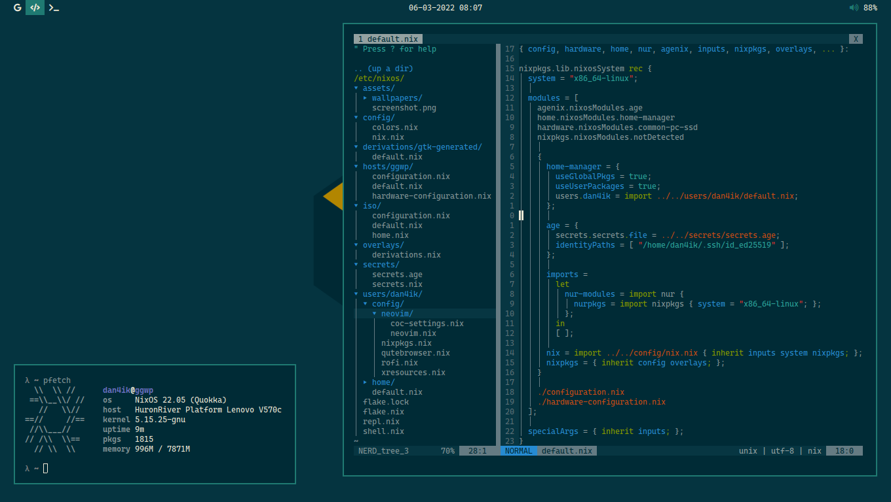

<p align="center">
  <a href="https://nixos.org/nixos"></a>
</p>

<p align="center">
<a href="https://github.com/dan4ik605743/nix-config/actions/workflows/check-flake.yml"></a> <a href="https://github.com/dan4ik605743/nix-config/actions/workflows/check-format.yml"></a> <a href="https://github.com/dan4ik605743/nix-config/actions/workflows/check-build.yml"></a>
</p><p align="center"><a href="https://github.com/nixos/nixpkgs"></a>
</p>

## Installation
Get the latest NixOS 21.11 image <a href="https://releases.nixos.org/?prefix=nixos/unstable/">here</a>, do your partitions (root must be mounted at `/mnt`), then run the following commands
```
# move the output file of this to hosts/ggwp/hardware-configuration.nix
nixos-generate-config --root /mnt

nix-shell -p git nixFlakes
git clone https://github.com/dan4ik605743/nix-config /mnt/etc/nixos
nix build /mnt/etc/nixos#ggwp --experimental-features "flakes nix-command" --store "/mnt"
nixos-install --root /mnt --system ./result
```

### Caveats
* You probably should replace <a href="https://github.com/dan4ik605743/nix-config/blob/master/hosts/ggwp/hardware-configuration.nix">hardware-configuration.nix</a> with your own with `nixos-generate-config`.
* You probably want to change <a href="https://github.com/dan4ik605743/nix-config/tree/master/users/dan4ik/config/neovim">neovim-configuration</a>.
* You probably want to change <a href="https://github.com/dan4ik605743/nix-config/tree/master/iso">iso-configuration</a>.

## Description
NixOS configuration that I use daily, it contains the system-wide and home configuration, symlinked to `/etc/nixos`.

See also:
* <a href="https://github.com/nix-community/home-manager">home-manager</a>
* <a href="https://nixos.wiki/wiki/Flakes">flakes</a>
* <a href="https://github.com/dan4ik605743/nur">my NUR repo</a>

Resources and configurations I used to base on:
* <a href="https://github.com/fortuneteller2k/nix-config">fortuneteller2k/nix-config</a>
* <a href="https://github.com/hlissner/dotfiles">hlissner/dotfiles</a>
* <a href="https://nixos.wiki/wiki/Configuration_Collection">NixOS configurations Collection</a>

## Iso
Iso with my basic configuration, you can start the system and see how it will look, and understand if you want to install it on a real host.

To create iso run the following commands
```
# the default login for iso is dan4ik:iso

nix-shell -p git nixFlakes
git clone https://github.com/dan4ik605743/nix-config
nix build ./nix-config#iso
```

Or you can <a href="https://drive.google.com/file/d/1uiocJx6H2kzfmyZAfmpumDjz_Xq94eoN/view?usp=sharing">download</a> what I have already builded.
 
## List of dependencies
* I3 (Window Manager)
* Bash (Shell)
* Htop (Task Manager)
* Compton (Composer)
* Urxvt (Terminal)
* Qutebrowser (Browser)
* Polybar (Bar)
* Playerctl (Playback control)
* Dunst (Demon notifications)
* Maim (Screenshoter)
* Rofi (Launcher)
* Neovim (Code Editor)

## Appearance

